<route>
{
  "meta": {
    "layout": "blog",
    "bid": 3,
    "title": "通过 Vercel 部署前端项目",
    "time": "2022-01-25T19:18:29.606Z",
    "tags": ["技术", "前端"],
    "type": "md"
  }
}
</route>

如果你还在手动地部署你的前端项目，那么你应该试试 **[Vercel](https://vercel.com/)**！

Vercel 提供了近乎开箱即用的 CI/CD 服务，可以自动地对前端项目进行构建，然后将其部署到 Vercel 的服务器上，不仅可以为你省下手动部署的时间，甚至还可以省下你的服务器。

Vercel 以 [Github Apps](https://docs.github.com/en/developers/apps/getting-started-with-apps/about-apps) 的形式安装到你的 Github，在你授权之后，取得对你的仓库的读写权限。当有新的提交被推送到生产分支（默认为主分支）时，Vercel 会自动地对生产分支中最新的提交进行构建，然后将构建结果（一般是 `dist` 目录）作为生产版本进行部署。而当有提交被推送到非生产分支、或有 Pull Request 被创建时，Vercel 也会对其进行构建，并将构建结果作为预览版本进行部署。

下面以本站为例，演示一下如何通过 Vercel 部署一个前端项目。 

### 登录

Vercel 支持通过 Github、Gitlab、Bitbucket 这三个平台的账号来登录。此处我选择通过 Github 登录，点击第一个按钮后在弹出的页面中使用 Github 的账号登录即可。

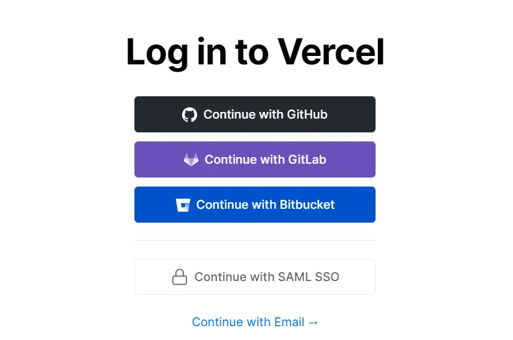

### 创建项目

登录之后会导航到 Vercel 的主页面，在这里可以进行项目的创建与管理。

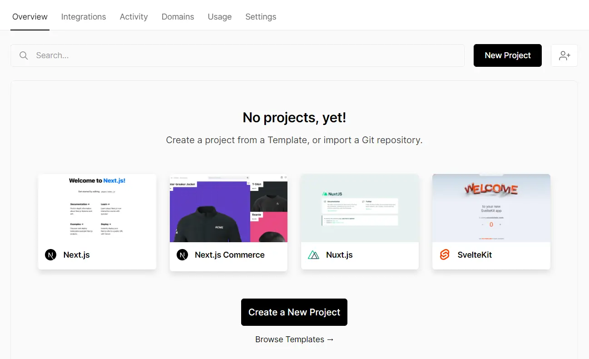

点击上图中的 **New Project** 按钮，进入以下页面。在搜索框中输入想要部署的前端项目的仓库名。

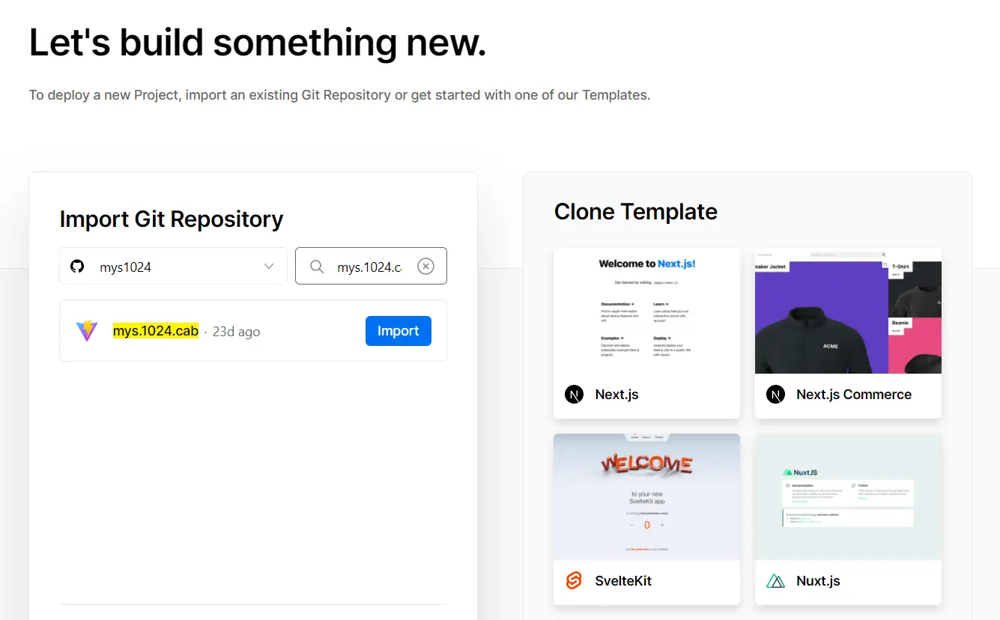

点击对应仓库的 **Import** 按钮，进行一些简单的配置，然后点击 **Deploy** 按钮。

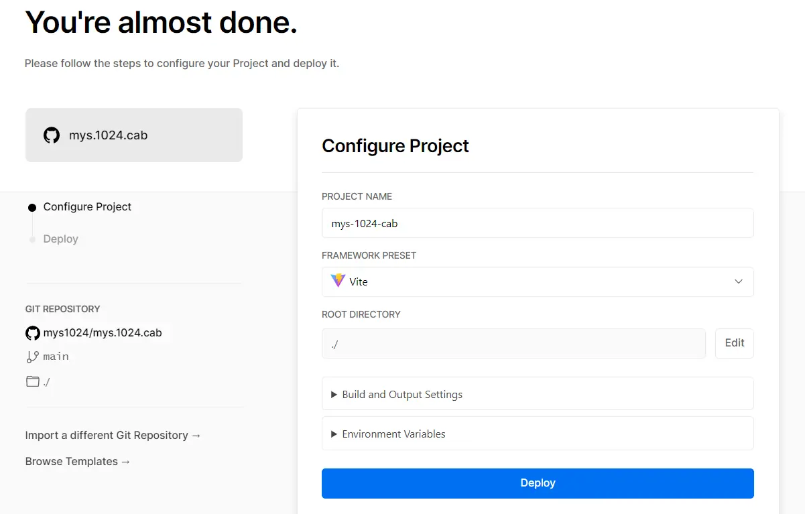

当看到下面这个撒彩条的场景时，恭喜你，这个项目就已经创建并且部署成功了！🎉🎉🎉


### 访问

项目创建完成后，在项目的管理页面中可以看到本项目被部署在了 `https://mys-1024-cab.vercel.app` 这个地址，访问这个地址即可访问到这个项目的生产部署。

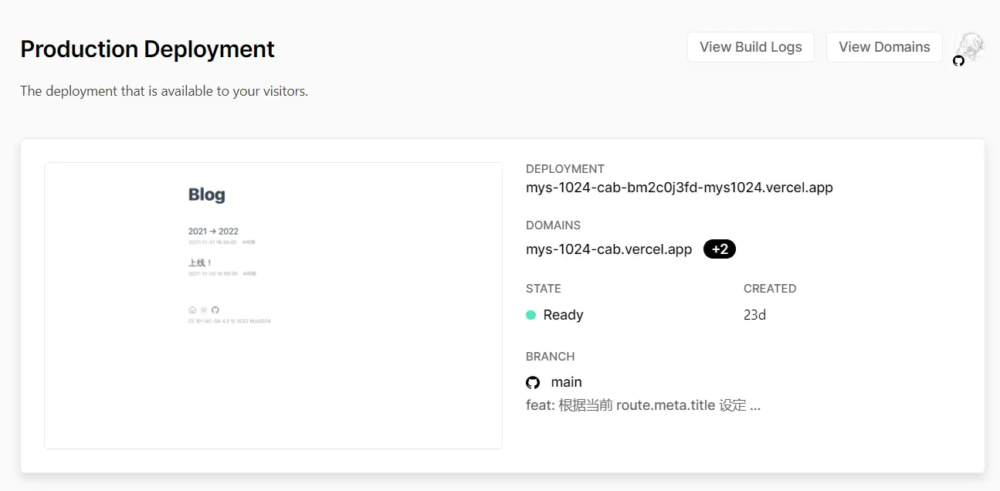

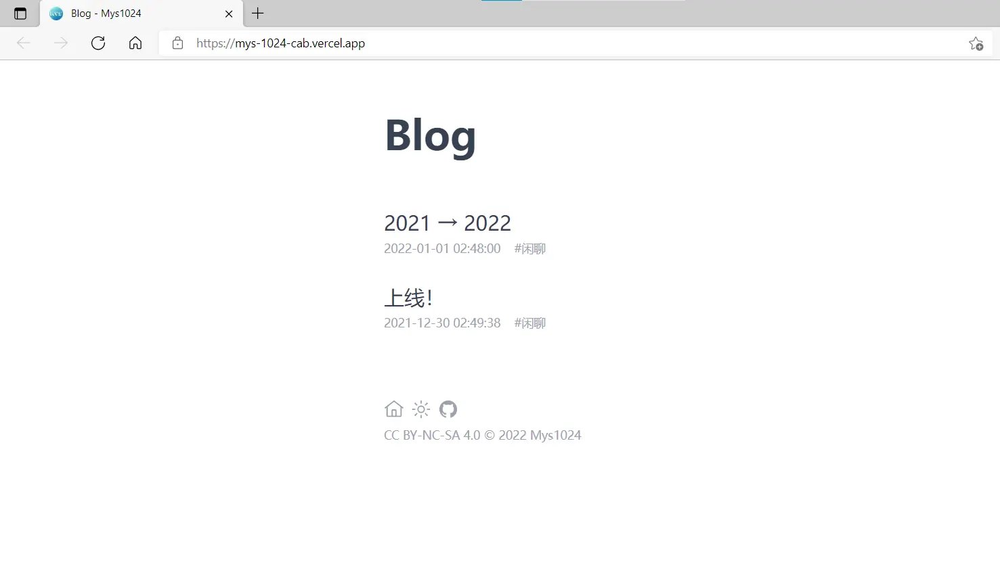

### 添加域名

如果你拥有自己的域名，你可以在 Vercel 的项目设置中添加这个域名，并按照指引为你的域名添加 `CNAME` 记录，将你的域名解析到 `cname.vercel-dns.com` 这个域名。

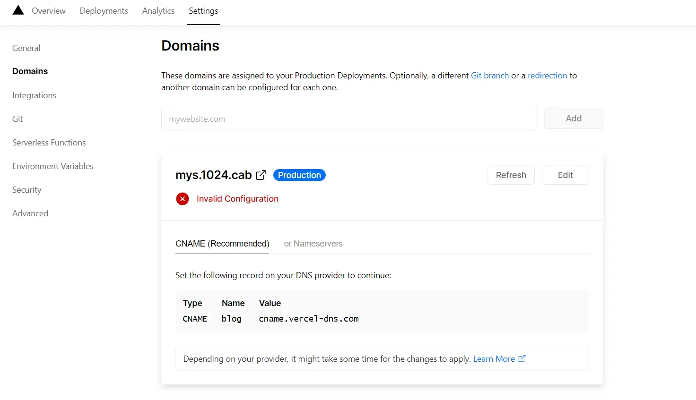

等待一会之后点击 **Refresh** 按钮，新增的域名就通过验证了。

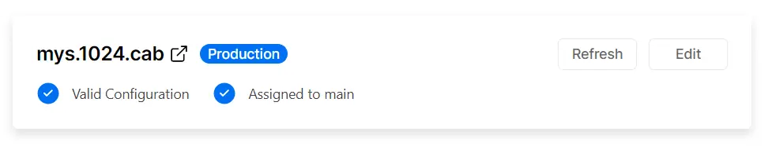

此时通过你自己域名也能访问到这个项目了！

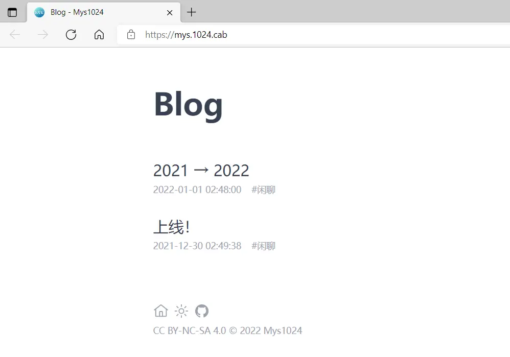

### Github 自动留言

项目创建完成之后，每当 Vercel 被 Github 仓库中的 Push 与 Pull Request 触发部署，会自动地在其详情页中留言，给出本次生产部署或预览部署的地址。

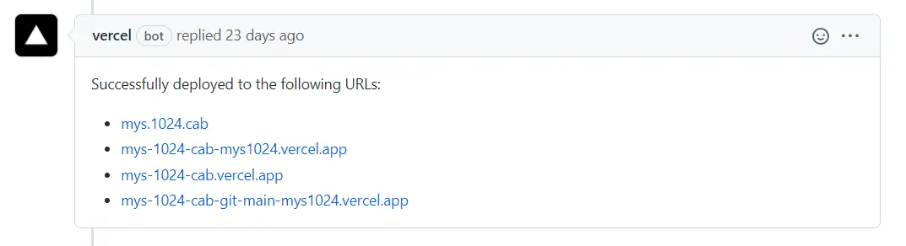

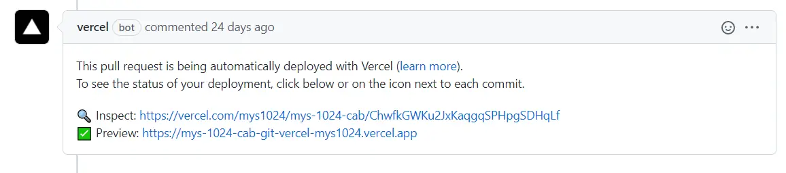

### 解决单页面应用的 404 问题

如果你的前端项目是个[单页面应用](https://zh.wikipedia.org/wiki/%E5%8D%95%E9%A1%B5%E5%BA%94%E7%94%A8)（Single-page application, SPA），那么你的前端项目很有可能会出现 404 问题。

一般来说，使用了 Vue、React 等当下流行的前端框架的前端项目都是单页面应用。所谓单页面，指的是整个网站于浏览器而言实际上仅有单个页面。而这个页面就是构建结果中的 `index.html`，它是单页面应用的唯一入口。单页面应用中能被用户所看到的页面与 URL 的变化，是由前端框架的路由模块（如 Vue Router）模拟而来。

举个例子，从本站的博客列表页面点击进入第一篇博客，地址栏中的地址会从 `https://mys.1024.cab/` 变成 `https://mys.1024.cab/blog/1`。此时如果你开着浏览器的开发者工具，你会发现浏览器实际上并没有发出 GET `https://mys.1024.cab/blog/1` 的请求。这是因为本站就是一个单页面应用，页面和 URL 的变化归功于由本站所使用的路由模块 Vue Router。

单页面应用的优点很多，不在此处赘述。而使用单页面应用会面临一个问题——网站的入口必须是 `index.html`。在服务器没有对此专门配置过的情况下，如果直接访问 `https://mys.1024.cab/blog/1`，你将会看到 404 错误（本站已使用下文所述的方法配置过了，所以你并不会看到 404 错误）。因为 `/blog/1` 这个地址仅对单页面应用中的路由模块有意义，你必须先通过 `index.html` 进入单页面应用，才能通过其路由模块导航到 `/blog/1`。对于服务器而言，`/blog/1` 是一个不存在的资源。

解决的方法倒也简单，只要让服务器当发现浏览器在请求一个不存在的资源时，一律返回 `index.html` 的内容即可。这样一来，浏览器就可以通过 `index.html` 进入单页面应用，由其路由模块来完成导航工作。

通过 Vercel 部署的单页面应用同样有着上文所述的 404 问题。参考 Vercel 的[配置文档](https://vercel.com/docs/cli#project-configuration/rewrites)，只需要完成以下简单的三步即可解决此问题。

1. 在项目的根目录下创建 `vercel.json` 文件。

2. 将下面的 JSON 粘贴到 `vercel.json` 中。

    ```json
    {
      "rewrites": [
        { 
          "source": "/(.*)",
          "destination": "/"
        }
      ]
    }
    ```
  
3. 提交 `vercel.json` 并推送到 Github。

### 结语

提供与 Vercel 类似的服务的平台还有 [Netlify](https://www.netlify.com/)，而国内也有腾讯云的 [CloudBase Webify](https://cloud.tencent.com/product/webify)。这类服务很大程度上简化了前端项目的部署工作，是个好东西 👍。
