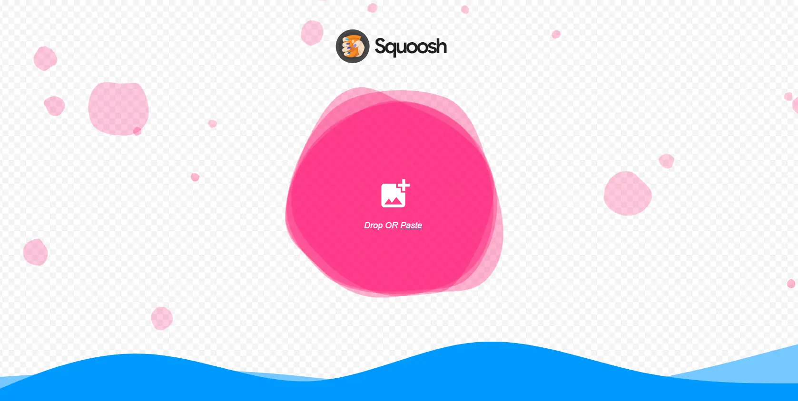
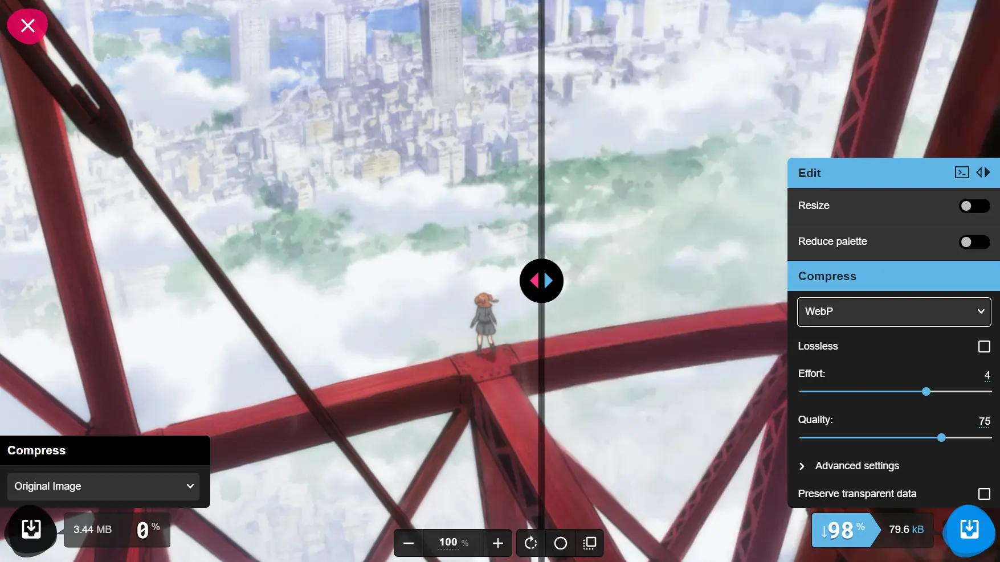
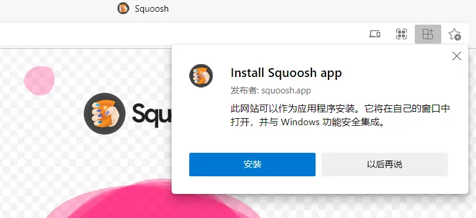
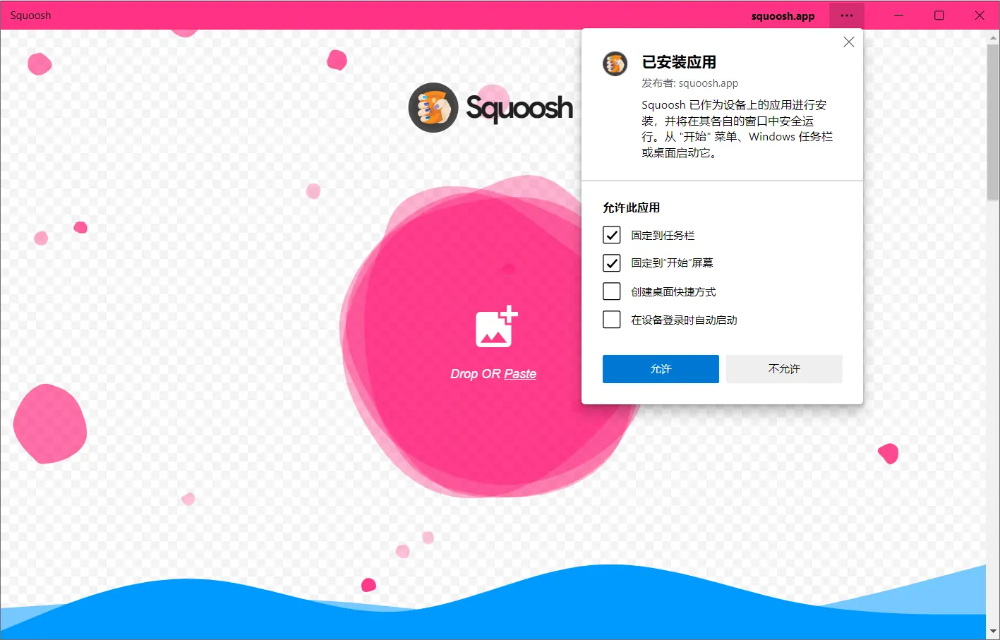

<route>
{
  "meta": {
    "layout": "blog",
    "bid": 4,
    "title": "图片压缩工具 Squoosh",
    "time": "2021-12-31T18:48:00.938Z",
    "tags": ["工具"],
    "type": "md"
  }
}
</route>


**[Squoosh](https://squoosh.app/)** 是一个仅需浏览器就可以运行的图片压缩应用，直接访问其网址 `https://squoosh.app/` 即可打开 Squoosh 的主界面。



### 使用

将想要压缩的图片拖拽或粘贴到 Squoosh 的主界面中，进入编辑器界面。在编辑器界面可以选择压缩图片的输出格式，并设置压缩相关的参数。



编辑器界面中间的分割线将图片分为左右两部分，左边的是原始的图片，而右边的是压缩之后的图片。上下滚动鼠标的滚轮可以放大、缩小图片。通过这两个操作可以很直观地看出图片压缩前后的区别，方便进一步调整压缩参数。

调整满意之后点击右下角的下载按钮即可保存压缩之后的图片。

### 以 PWA 的形式安装

如果你的浏览器支持 [PWA](https://developer.mozilla.org/zh-CN/docs/Web/Progressive_web_apps)，那么你可以以 PWA 的形式安装 Squoosh。

第一个好处是可以直接从桌面打开 Squoosh。省去了先打开浏览器，再从收藏夹里打开 Squoosh 的功夫。

第二个好处，也是最大的好处，是不需要网络也可以使用 Squoosh！

Squoosh 的工作机制并不是将图片发送到它的服务器，然后再将压缩后的图片发回给你，而是直接通过你的浏览器执行压缩图片的代码。也就是说图片压缩操作实际上是在本地完成的，所以并不需要网络。

压缩图片所需要的代码在你访问 Squoosh 的时候下载到你的浏览器中，由于 PWA 的特性，Squoosh 的代码可以保存在你的本地。因此只需要在联网的时候将 Squoosh 以 PWA 的形式安装，在没有网络的时候也能正常使用 Squoosh。





### 使用 Squoosh CLI

Squoosh 的图形界面虽然简单而又直观，但是并不支持批量压缩图片。而使用 Squoosh 的命令行版本 Squoosh CLI 可以批量地对图片压缩。Squoosh CLI 是一个 **[Node.js](https://nodejs.org/en/)** 的 Package，所以它需要在 Node.js 的环境下运行。

Squoosh CLI 的用法也非常简单，只需下面这一行命令即可将当前目录下的 `png` 格式的图片压缩并转换为 `webp` 格式的图片：

```bash
npx @squoosh/cli --webp auto *.png
```

<small>*注：在 Windows 中使用 PowerShell 或 CMD 来执行这行命令会出错。作为代替，可使用 Git Bash 或 WSL 来执行这行命令。*</small>

Squoosh CLI 的详细用法可以参考它的[官方文档](https://github.com/GoogleChromeLabs/squoosh/tree/dev/cli)。
